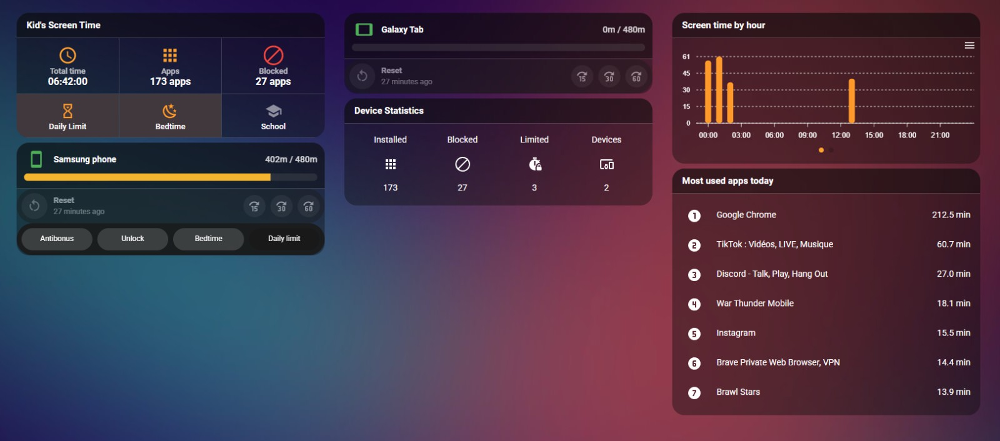

# Example dashboard

A ready-to-use Lovelace dashboard focused entirely on the **Google Family Link**
integration — screen time, per-device limits, bedtime / school time, app blocking,
time bonuses and the "most used apps" list.

## How to use it

1. **Settings → Dashboards → + Add dashboard → New dashboard from scratch**, give it a name.
2. Open it → **⋮ (top-right) → Edit dashboard** → *Take control* → **⋮ → Raw configuration editor**.
3. Select everything, delete, and paste the contents of [`lovelace-dashboard.yaml`](lovelace-dashboard.yaml), then **Save**.
4. **Replace the placeholder entity IDs** with yours:
   - `sensor.firstname_lastname_*` → your child sensors (e.g. `sensor.john_doe_*`)
   - `switch.child_tablet`, `sensor.child_tablet_*`, `button.child_tablet_*` → your tablet device
   - `sensor.child_phone_*`, `switch.child_phone` → your phone device
   - `switch.firstname_lastname_bedtime`, `switch.firstname_lastname_daily_limit`
   - `input_boolean.child_school_mode` (create a helper) and the optional
     `automation.child_*` entities used by the toggle chips (anti-unlock, bedtime
     enabler, daily-limit enabler) — remove those rows if you don't use them.

   The exact entity names come from **your** Family Link integration — check
   **Developer Tools → States** and filter on your child's name / device name.

## Layout

The view uses the modern **`sections`** layout (`type: sections`), grouped into three
sections — *Screen Time*, *Devices*, *Insights* — so cards reflow and stay balanced
across screen widths. Change `max_columns` to control how wide it spreads on large
displays.

## Required custom cards (HACS)

Install these from **HACS → Frontend** before pasting the YAML, otherwise cards render
as "Custom element doesn't exist":

| Card | HACS name |
|------|-----------|
| Button card | `custom:button-card` |
| Mushroom | `custom:mushroom-*` (mushroom-title-card) |
| Bubble card | `custom:bubble-card` |
| card-mod | `custom:mod-card` / `card_mod:` |
| stack-in-card | `custom:stack-in-card` |
| vertical-stack-in-card | `custom:vertical-stack-in-card` |
| Swipe card | `custom:swipe-card` |
| ApexCharts card | `custom:apexcharts-card` |
| template-entity-row | `custom:template-entity-row` |

> `card-mod` also needs to be registered as a frontend resource — see the
> [card-mod docs](https://github.com/thomasloven/lovelace-card-mod#installation).

## Theme

The screenshot uses the **`ios-dark-mode-blue-red`** theme (HACS → Frontend,
*"iOS Themes"*). The view sets `theme: ios-dark-mode-blue-red` at the top — change or
remove that line to use your own theme. The cards work with any dark theme; only the
exact colours differ.
