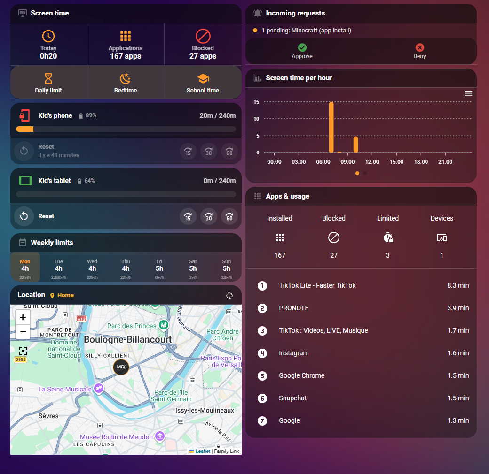

# Example dashboard

A ready-to-use Lovelace dashboard built around the Google Family Link integration: screen time, per-device limits, bedtime and daily limit toggles, time bonuses, app usage and a location map.

## Import it

1. **Settings > Dashboards > + Add dashboard > New dashboard from scratch**, give it a name.
2. Open it, **Edit dashboard**, *Take control*, then open the **Raw configuration editor** (top-right menu).
3. Select everything, delete, paste the contents of [`lovelace-dashboard.yaml`](lovelace-dashboard.yaml), then **Save**.

The file contains one masonry view ("Parental Control") with the cards of the screenshot: screen time and toggles, the phone with its time bonuses, the weekly limits, the hourly chart, apps and usage, and the location map.

## Replace the placeholder entities

The YAML was exported from a real setup (Family Link 2.0). Find your own entity ids in **Developer Tools > States** (filter on your child's or device's name) and replace:

| Placeholder | Replace with |
|-------------|--------------|
| `sensor.firstname_name_*` (daily_screen_time, screen_time_formatted, installed_apps, blocked_apps, apps_with_time_limits, device_count, battery_level, top_app_1 to top_app_7) | your child's sensors |
| `switch.firstname_name_bedtime`, `switch.firstname_name_daily_limit`, `switch.firstname_name_school_time` | your child's restriction switches (the strict mode switch, `switch.firstname_name_strict_mode`, fits the same row if you want it on the dashboard) |
| `number.firstname_name_<weekday>_limit`, `time.firstname_name_<weekday>_bedtime_start` / `_end` | your child's weekly limits entities (2.0) |
| `switch.sm_s916b`, `sensor.sm_s916b_*` (screen_time_remaining, daily_limit, active_bonus), `button.sm_s916b_*` (15min, 30min, 60min, reset_bonus) | your phone's entities |
| `device_tracker.firstname_name_family_link_firstname_name` | your child's device tracker (requires GPS tracking enabled in the integration options) |

## Cards that need extra work

Two cards reference entities the integration does **not** create:

| Entity | Used for |
|--------|----------|
| `sensor.firstname_ecran_par_heure` | hourly screen time chart, a template sensor that stores the minutes used in the current hour (a `derivative` or `utility_meter` helper on `sensor.firstname_name_daily_screen_time` with an hourly cycle works) |
| `sensor.firstname_pending_requests`, `button.firstname_approve_request`, `button.firstname_deny_request` | the "Incoming requests" card (app and time requests); Family Link does not expose them, the author's come from another parental-control integration |

Build equivalents or delete those cards.

## Weekly limits card (2.0)

Version 2.0 adds one `number` per weekday (the screen time quota) and two `time` entities per weekday (bedtime start and end) for each child. [`weekly-limits-card.yaml`](weekly-limits-card.yaml) is the card shown at the bottom of the Family Link column: one tile per weekday with the quota, the bedtime window under it and today highlighted. Tap a day to change its quota, long press to change the bedtime start, double tap for the bedtime end. Paste it as a new card (**Add card > Manual**) and replace `firstname_name` with your child's slug (`number.firstname_name_monday_limit`, `time.firstname_name_monday_bedtime_start`, and so on). It needs button-card, card-mod, Mushroom and vertical-stack-in-card.

With strict mode on, the values written from this card are the reference the integration puts back if they are changed in the Family Link app.

## Required custom cards (HACS)

Install these from **HACS > Frontend** before pasting the YAML, otherwise cards render as "Custom element doesn't exist":

| Card | Element |
|------|---------|
| button-card | `custom:button-card` |
| Mushroom | `custom:mushroom-title-card` |
| Bubble Card | `custom:bubble-card` |
| card-mod | `custom:mod-card` / `card_mod:` |
| stack-in-card | `custom:stack-in-card` |
| vertical-stack-in-card | `custom:vertical-stack-in-card` |
| Swipe Card | `custom:swipe-card` |
| ApexCharts Card | `custom:apexcharts-card` |
| template-entity-row | `custom:template-entity-row` |
| Map Card | `custom:map-card` |

> `card-mod` also needs to be registered as a frontend resource, see the
> [card-mod docs](https://github.com/thomasloven/lovelace-card-mod#installation).

## Theme

The view sets `theme: ios-dark-mode-blue-red` (HACS > Frontend, "iOS Themes"). Change or remove that line to use your own theme; the cards work with any dark theme, only the exact colors differ.
